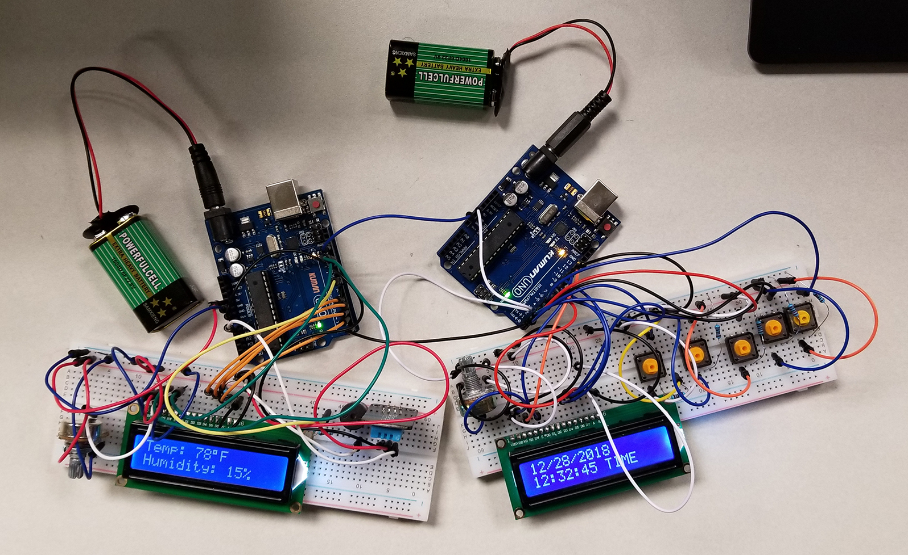

# cs362-FinalProject
## Final Arduino project for CS362: Computer Design
## By Allen Breyer and Michael Tran

## Description
A self-chosen project that involved designing an alarm clock that is able to provide useful functions for an individual. Functions are not limited to but including date, time, customizable alarm, measuring humidity, and measuring temperature of the room. The DHT11 sensor can measure both humidity and temperature and it is what we used for our project. The two Arduinos communicate to one another via serial communication so that we can split the work of our design.

## Final Project Report
https://github.com/abreyer3/cs362-FinalProject/blob/master/Weather_Monitoring_Alarm_Clock_Final_Report.pdf

## Demo Video
https://drive.google.com/file/d/1Y4Cd0bjyfTYHk95YscELQ0vtT2mDnxOR/view?usp=sharing
